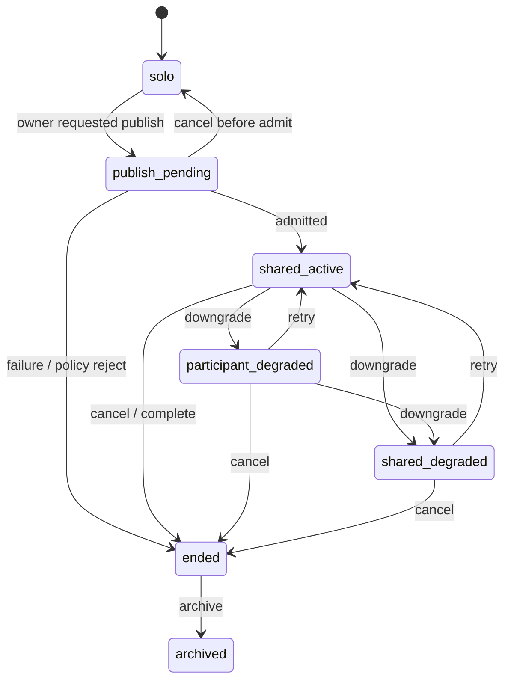

# Collaboration Session Lifecycle Statechart

Source contracts: `docs/collaboration/session_authority_contract.md`,
`schemas/collaboration/session_state.schema.json`,
`schemas/collaboration/shared_object.schema.json`,
`docs/ux/notification_delivery_contract.md`.

## States

| State | Meaning | Terminal | Recoverable | Retryable | Evidence / export / audit fields |
| --- | --- | --- | --- | --- | --- |
| `solo` | Local workspace, no collaboration session in flight. | No | Yes | No | workspace identity ref |
| `publish_pending` | Owner requested publish; relay, trust, and target identity are being evaluated. | No | Yes | Yes | transition record, policy context |
| `shared_active` | Participants attached; relay healthy; shared objects flowing. | No | Yes | No | session record, participant refs |
| `participant_degraded` | One participant degraded while others continue. | No | Yes | Yes | downgrade record, preservation state |
| `shared_degraded` | Session-wide degradation; local editing remains unfrozen. | No | Yes | Yes | downgrade record, relay state |
| `ended` | Session ended; no new participants admitted; archive may still seal. | Yes | Yes | No | transition record, archive preparation refs |
| `archived` | Sealed session archive exists; further activity opens a new session. | Yes | No | No | sealed archive ref, export refs |

## Statechart

## Transitions And Authority

| Transition | From -> To | Recovery | Initiate | Approve / reject | Retry / repair | Preview | Checkpoint | Evidence / export / audit fields |
| --- | --- | --- | --- | --- | --- | --- | --- | --- |
| `lifecycle.collaboration_session.publish` | `solo` -> `publish_pending` | none | `session_owner`, `interactive_user` | `policy_service`, workspace trust | n/a | Yes when publish exposes workspace/session metadata | No | transition record, policy context |
| `lifecycle.collaboration_session.admit` | `publish_pending` -> `shared_active` | none | `owning_subsystem`, `remote_agent` | `session_owner`, `policy_service` | n/a | Join summary required | No | participant refs, relay state, audit event |
| `lifecycle.collaboration_session.publish_cancel` | `publish_pending` -> `solo` or `ended` | `cancel` or `failure` | `session_owner`, `policy_service`, `owning_subsystem` | n/a | `session_owner` may retry publish | No | No | transition reason, audit event |
| `lifecycle.collaboration_session.participant_downgrade` | `shared_active` -> `participant_degraded` | `downgrade` | `remote_agent`, `owning_subsystem`, `policy_service` | `policy_service` | affected `participant`, `session_owner` | Details surface required | Preserve local work refs required | downgrade record, local preservation state |
| `lifecycle.collaboration_session.shared_downgrade` | `shared_active` or `participant_degraded` -> `shared_degraded` | `downgrade` | `owning_subsystem`, `remote_agent`, `policy_service` | `policy_service` | `session_owner`, `participant` | Details surface required | Preserve local work refs required | relay state, downgrade record |
| `lifecycle.collaboration_session.recover` | degraded states -> `shared_active` | `retry` or `stale_reconciliation` | `session_owner`, affected `participant`, `owning_subsystem` | `policy_service` may reject | `owning_subsystem` | Rejoin summary required | Local journals preserved | recovery path class, audit event |
| `lifecycle.collaboration_session.end` | active/degraded states -> `ended` | `cancel` | `session_owner`, last participant, `policy_service` | `session_owner` for voluntary end | n/a | Archive-scope preview when sealing follows | No | transition record, consent/retention refs |
| `lifecycle.collaboration_session.archive` | `ended` -> `archived` | none | `session_owner`, `admin` | `policy_service`, admin for managed sessions | n/a | Yes | No unless archive mutates retention state | sealed archive ref, export posture, audit event |

Boundary rule: degraded or ended collaboration state must not freeze or
roll back any participant's local buffer. Shared projection can pause;
local durable work continues under local authority.
