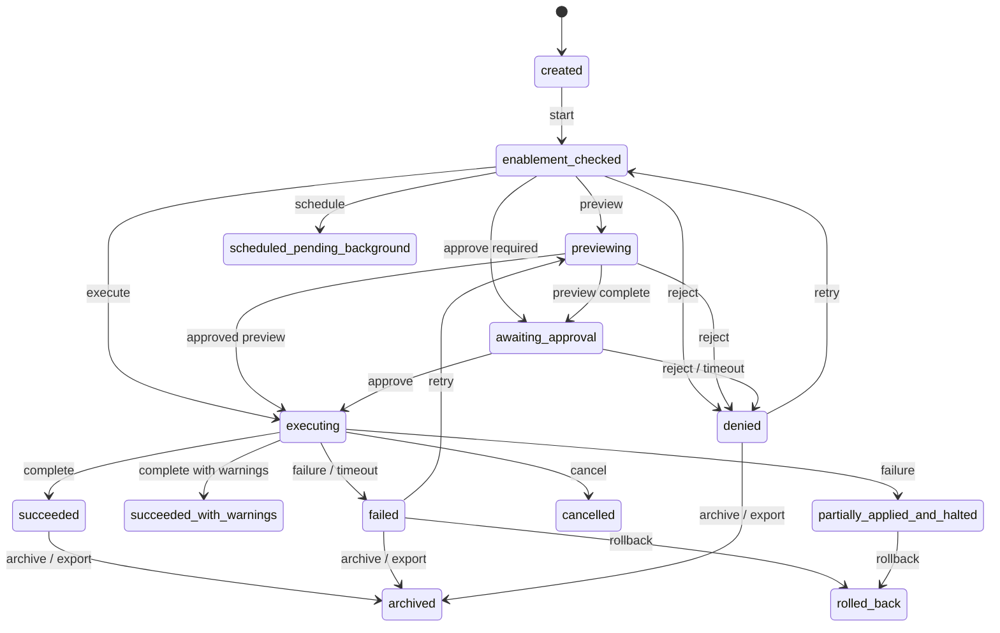

# Command Invocation Lifecycle Statechart

Source contracts: `docs/commands/command_descriptor_contract.md`,
`docs/governance/runtime_authority_contract.md`,
`docs/commands/shareability_and_automation_contract.md`,
`docs/ux/menu_command_bar_contract.md`.

## States

| State | Meaning | Terminal | Recoverable | Retryable | Evidence / export / audit fields |
| --- | --- | --- | --- | --- | --- |
| `created` | Invocation packet exists but enablement has not been evaluated. | No | Yes | No | invocation session id, descriptor ref |
| `enablement_checked` | Descriptor, context, trust, lifecycle, and disabled reason resolved. | No | Yes | Yes | enablement decision, disabled reason |
| `previewing` | Preview or dry-run artifact is being built or shown. | No | Yes | Yes | preview ref, preview class |
| `awaiting_approval` | Preview passed and an approval or authority ticket is required. | No | Yes | Yes | approval posture, authority ticket ref |
| `executing` | Command is applying, running, dispatching, or publishing. | No | Yes | Yes | execution intent, context snapshot |
| `scheduled_pending_background` | Command was admitted as background work. | No | Yes | Yes | queue/admission ref, background job ref |
| `succeeded` | Invocation completed with declared result contract. | Yes | No | Yes | outcome class, created artifacts, evidence refs |
| `succeeded_with_warnings` | Invocation completed with typed warnings. | Yes | Yes | Yes | warning refs, evidence refs |
| `denied` | Enablement, preview, approval, or policy denied the invocation. | Yes | Yes | Yes when cause can change | denial reason, repair hook ref |
| `cancelled` | User, policy, or supervisor cancelled before completion. | Yes | Yes | Yes when idempotent | cancellation actor, audit event |
| `failed` | Execution failed with typed error. | Yes | Yes | Yes when idempotent | error reason, evidence refs |
| `rolled_back` | Apply ran and rollback or revert completed. | Yes | Yes | Yes | rollback checkpoint ref, audit event |
| `partially_applied_and_halted` | Some declared artifacts applied and others did not. | Yes | Yes | Yes after review | applied/unapplied artifact refs |
| `archived` | Invocation evidence is sealed for history/support/export. | Yes | No | No | export refs, audit event refs |

## Statechart

## Transitions And Authority

| Transition | From -> To | Recovery | Initiate | Approve / reject | Retry / repair | Preview | Checkpoint | Evidence / export / audit fields |
| --- | --- | --- | --- | --- | --- | --- | --- | --- |
| `lifecycle.command_invocation.create` | `created` -> `enablement_checked` | none | `interactive_user`, `command_router`, `automation_scheduler`, `ai_assistant`, `extension_host` | `command_router`, `policy_service` may reject | n/a | No | No | descriptor ref, context snapshot, enablement decision |
| `lifecycle.command_invocation.preview` | `enablement_checked` -> `previewing` | none | `command_router` | `policy_service` may reject | `interactive_user` | Yes | Checkpoint if preview prepares mutation | preview ref, preview class |
| `lifecycle.command_invocation.approval` | `previewing` -> `awaiting_approval` -> `executing` | none | `command_router` | `interactive_user`, `admin`, `policy_service`, `second_party_reviewer` | n/a | Yes | Yes for durable or external mutation | authority ticket ref, approval ref, audit event |
| `lifecycle.command_invocation.direct_execute` | `enablement_checked` -> `executing` | none | `command_router` | `policy_service` | n/a | No only for no-preview trusted paths | No for read/query, otherwise not allowed | execution intent, result contract |
| `lifecycle.command_invocation.schedule` | `enablement_checked` -> `scheduled_pending_background` | none | `automation_scheduler`, `command_router` | `policy_service` | `automation_scheduler` | Preview when side effects are non-trivial | Idempotency key required | background job ref, audit event |
| `lifecycle.command_invocation.deny` | any pre-execute state -> `denied` | `timeout` when approval expires | `command_router`, `policy_service`, approver | n/a | `interactive_user` when cause can change | n/a | No | disabled reason, denial reason, repair hook |
| `lifecycle.command_invocation.cancel` | `executing` or `scheduled_pending_background` -> `cancelled` | `cancel` | `interactive_user`, `policy_service`, `supervisor` | n/a | `interactive_user` when idempotent | No | Preserve prior evidence | cancellation actor, audit event |
| `lifecycle.command_invocation.fail` | `executing` -> `failed` or `partially_applied_and_halted` | `failure` or `timeout` | `command_router`, `owning_subsystem` | n/a | `interactive_user`, `automation_scheduler` under lineage | No | Preserve checkpoint when mutation began | error reason, applied/unapplied artifact refs |
| `lifecycle.command_invocation.rollback` | `failed` or `partially_applied_and_halted` -> `rolled_back` | `rollback` | `supervisor`, `interactive_user`, `command_router` | User/admin if rollback changes durable state | `interactive_user` | Yes unless automatic rollback was pre-approved | Rollback checkpoint required | rollback ticket/checkpoint ref, audit event |
| `lifecycle.command_invocation.archive` | terminal states -> `archived` | none | `workspace_owner`, `support_operator`, `admin` | User/admin for export | n/a | Yes for export | No | invocation export refs, support export row, audit event |

Boundary rule: `ai_assistant`, `extension_host`, and
`automation_scheduler` may propose or initiate, but they cannot approve
their own high-risk command invocation.
