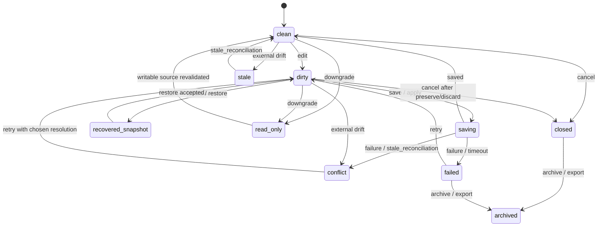

# Document Buffer Lifecycle Statechart

Source contracts: `docs/ux/editor_document_state_contract.md`,
`docs/workspace/mutation_lineage_model.md`,
`docs/architecture/generated_artifact_safe_edit_policy.md`,
`docs/governance/runtime_authority_contract.md`.

## States

| State | Meaning | Terminal | Recoverable | Retryable | Evidence / export / audit fields |
| --- | --- | --- | --- | --- | --- |
| `clean` | Buffer matches its current writable source or declared read basis. | No | Yes | No | stable document ref, content ref |
| `dirty` | Buffer has unsaved or unapplied local authority. | No | Yes | Yes | dirty authority ref, mutation journal ref |
| `saving` | Save/apply is in progress under VFS or mutation authority. | No | Yes | Yes | save target token, checkpoint ref |
| `conflict` | Save, external change, restore, or compare authority disagrees. | No | Yes | Yes | conflict ref, compare basis refs |
| `recovered_snapshot` | Buffer came from journal, checkpoint, crash recovery, or evidence. | No | Yes | Yes | restore provenance ref, checkpoint ref |
| `read_only` | Current surface can inspect but cannot write visible bytes. | No | Yes | No | read-only reason, source/action refs |
| `stale` | Projection is behind source, runtime, policy, or generation basis. | No | Yes | Yes | stale basis ref, last known good ref |
| `failed` | Save/reload/restore failed with typed reason. | Yes | Yes | Yes | failure reason, support evidence refs |
| `closed` | Buffer view is closed; durable state lives in source/journal/history. | Yes | Yes | Yes | close action ref, restore prompt ref |
| `archived` | Buffer evidence or recovery snapshot is sealed for export/history. | Yes | No | No | export refs, audit event refs |

## Statechart

## Transitions And Authority

| Transition | From -> To | Recovery | Initiate | Approve / reject | Retry / repair | Preview | Checkpoint | Evidence / export / audit fields |
| --- | --- | --- | --- | --- | --- | --- | --- | --- |
| `lifecycle.document_buffer.edit` | `clean` -> `dirty` | none | `interactive_user`, admitted `automation_scheduler` | `policy_service` may reject blocked writes | n/a | No for direct edit | Journal checkpoint before generated/imported/multi-file apply | mutation id, actor ref, document state projection |
| `lifecycle.document_buffer.save` | `dirty` -> `saving` -> `clean` | none | `interactive_user`, `command_router` | `policy_service` may reject | `interactive_user` | Preview when generated, imported, recovered, policy locked, or multi-file | Yes for protected mutation | save target token, checkpoint ref, audit event |
| `lifecycle.document_buffer.save_conflict` | `saving` -> `conflict` | `failure` or `stale_reconciliation` | `owning_subsystem` | n/a | `interactive_user`, `supervisor` | Conflict review required | Preserve dirty journal | conflict ref, compare basis refs |
| `lifecycle.document_buffer.save_failed` | `saving` -> `failed` | `failure` or `timeout` | `owning_subsystem` | n/a | `interactive_user`, `support_operator` | No | Preserve dirty journal and checkpoint refs | failure reason, support evidence, audit event |
| `lifecycle.document_buffer.external_stale` | `clean` or `dirty` -> `stale` or `conflict` | `stale_reconciliation` | `owning_subsystem` | n/a | `interactive_user` | Review required when local edits exist | Yes when dirty | stale basis ref, last known good ref |
| `lifecycle.document_buffer.restore_snapshot` | `dirty` or `failed` -> `recovered_snapshot` | `rollback` | `supervisor`, `interactive_user`, `support_operator` | User required before replacing writable state | `interactive_user` | Yes | Yes | restore provenance ref, checkpoint ref |
| `lifecycle.document_buffer.policy_downgrade` | `clean` or `dirty` -> `read_only` | `downgrade` | `policy_service`, `supervisor` | `policy_service` | n/a | Details surface required | Preserve dirty state when present | read-only reason, policy epoch ref, audit event |
| `lifecycle.document_buffer.revalidate` | `read_only` or `stale` -> `clean` | `stale_reconciliation` | `interactive_user`, `owning_subsystem` | `policy_service` may reject | `interactive_user` | Review if authority changes | No unless source rewritten | source authority ref, audit event |
| `lifecycle.document_buffer.close` | `clean` or `dirty` -> `closed` | `cancel` | `interactive_user`, `workspace_owner` | User approves discard when dirty | `interactive_user` may reopen | Yes when dirty discard/export is offered | Preserve or explicit discard record | close action ref, restore prompt ref |
| `lifecycle.document_buffer.archive` | `closed` or `failed` -> `archived` | none | `workspace_owner`, `support_operator`, `admin` | User/admin when exported | n/a | Yes for export | No | export refs, redaction class, audit event |

Boundary rule: `clean`, `writable`, and `current` are default postures,
not substitutes for the non-default document-state badges in the editor
document-state contract.
