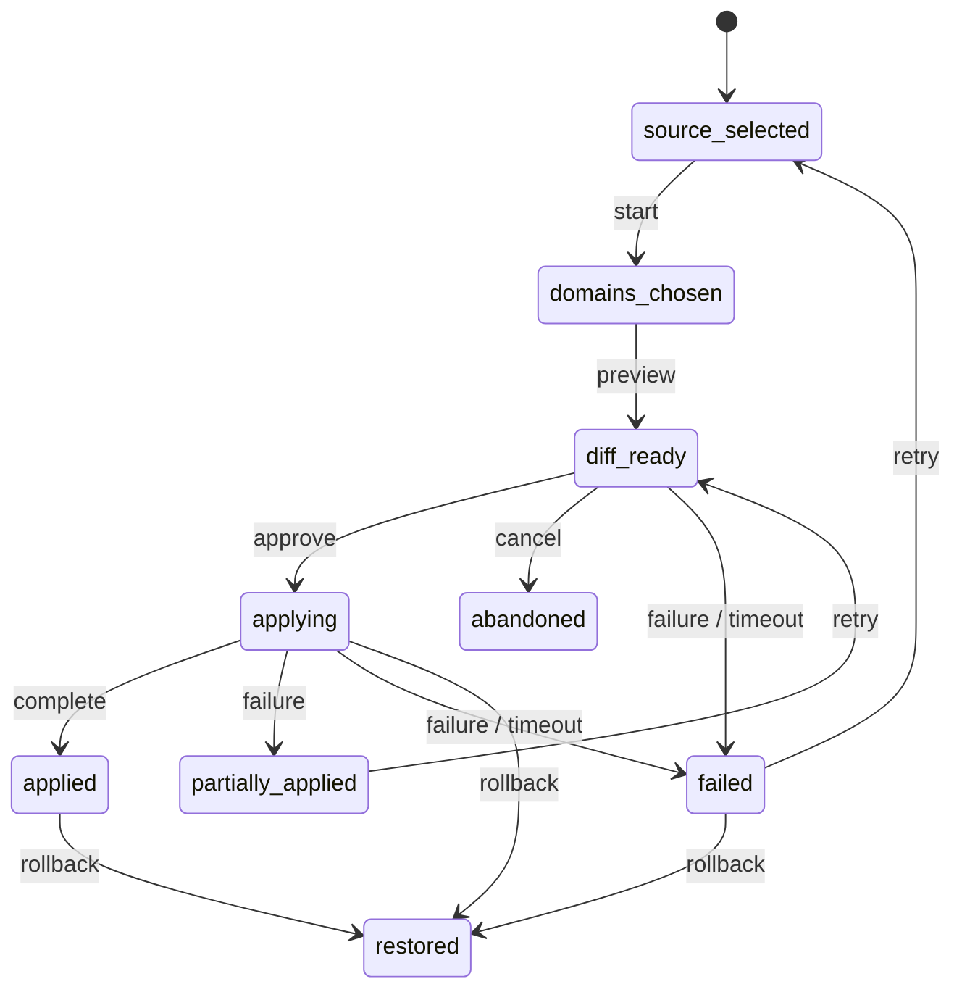

# Migration / Import Session Lifecycle Statechart

Source contracts: `docs/migration/migration_center_object_model.md`,
`schemas/migration/migration_session.schema.json`,
`schemas/migration/importer_outcome.schema.json`,
`docs/workspace/entry_restore_object_model.md`.

## States

| State | Meaning | Terminal | Recoverable | Retryable | Evidence / export / audit fields |
| --- | --- | --- | --- | --- | --- |
| `source_selected` | Source tool, version, profile, bundle, or support artifact is selected. | No | Yes | Yes | source descriptor, discovery ref |
| `domains_chosen` | User selected migration domains. | No | Yes | Yes | selected domains, actor |
| `diff_ready` | Preview/diff and compatibility linkage are ready for review. | No | Yes | Yes | compatibility refs, preview refs |
| `applying` | Importer is applying selected domains under checkpoint. | No | Yes | Yes | restore record ref, checkpoint ref |
| `applied` | Session applied successfully with outcome packet. | Yes | Yes | Yes through a new session | outcome packet ref, validation refs |
| `partially_applied` | Some domains applied and others require review/retry. | Yes | Yes | Yes | outcome packet, restore record ref |
| `restored` | Restore checkpoint was used to return prior state. | Yes | Yes | Yes through a new session | restore record ref, audit event |
| `failed` | Apply, preview, or discovery failed with typed reason. | Yes | Yes | Yes | failure reason, support packet refs |
| `abandoned` | User or policy ended the session without apply. | Yes | Yes | Yes through a new session | abandonment reason, audit event |

Archive/export is modeled as a terminal-state action over the migration
session and report refs; it does not add a new `migration_session_state`
value because the owning migration schema's closed state set does not
define `archived`.

## Statechart

## Transitions And Authority

| Transition | From -> To | Recovery | Initiate | Approve / reject | Retry / repair | Preview | Checkpoint | Evidence / export / audit fields |
| --- | --- | --- | --- | --- | --- | --- | --- | --- |
| `lifecycle.migration_import_session.select_source` | start -> `source_selected` | none | `interactive_user`, `support_operator`, `automation_scheduler` | `policy_service` may reject source | n/a | No | No | source descriptor, discovery ref |
| `lifecycle.migration_import_session.choose_domains` | `source_selected` -> `domains_chosen` | none | `interactive_user`, `support_operator` | `policy_service` may narrow domains | n/a | No | No | selected domains, actor ref |
| `lifecycle.migration_import_session.preview_diff` | `domains_chosen` -> `diff_ready` | none | `migration_importer` | `policy_service` may reject | `migration_importer` | Yes | No | compatibility report ref, preview refs |
| `lifecycle.migration_import_session.apply` | `diff_ready` -> `applying` -> `applied` | none | `interactive_user`, `migration_importer` | `interactive_user`, `policy_service`, `admin` when managed | n/a | Yes | Yes before apply | restore record ref, outcome packet ref |
| `lifecycle.migration_import_session.partial` | `applying` -> `partially_applied` | `failure` or `timeout` | `migration_importer` | n/a | `interactive_user`, `migration_importer` | Review required before retry | Restore checkpoint required | outcome packet counters, restore record ref |
| `lifecycle.migration_import_session.fail` | preview/apply states -> `failed` | `failure` or `timeout` | `migration_importer`, `policy_service` | n/a | `interactive_user`, `support_operator` | No | Preserve restore/checkpoint refs if apply began | failure reason, support packet refs |
| `lifecycle.migration_import_session.restore` | `applying`, `applied`, or `failed` -> `restored` | `rollback` | `interactive_user`, `support_operator`, `supervisor` | User/admin when managed | `migration_importer` | Yes | Restore checkpoint required | restore record ref, audit event |
| `lifecycle.migration_import_session.abandon` | `diff_ready` -> `abandoned` | `cancel` | `interactive_user`, `policy_service` | n/a | `interactive_user` through new session | No | No | abandonment reason, audit event |
| `lifecycle.migration_import_session.retry` | `failed` or `partially_applied` -> earlier review state | `retry` | `interactive_user`, `support_operator`, `migration_importer` | `policy_service` | `migration_importer` | Yes when diff changes | Checkpoint/idempotency ref required | predecessor session ref, outcome packet ref |
| `lifecycle.migration_import_session.export` | terminal states -> same terminal state | none | `interactive_user`, `support_operator`, `admin` | User/admin for export boundary | n/a | Yes | No | migration report ref, export refs, support packet refs |

Boundary rule: no migration apply may begin until `restore_record_ref`
and a checkpoint are present. `bridge_required` and `unsupported`
outcome rows remain visible in terminal exports.

