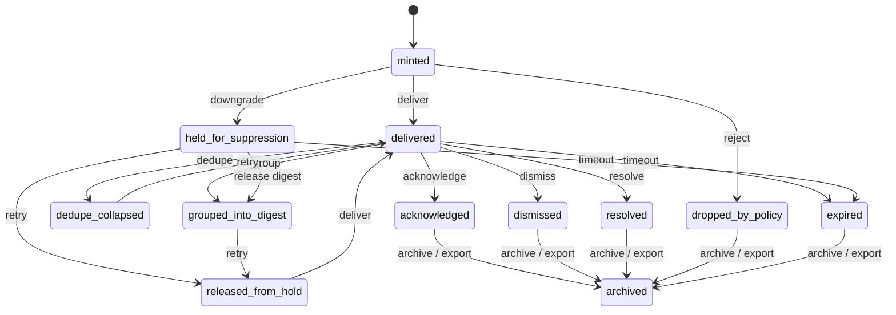

# Notification Lifecycle Statechart

Source contracts: `docs/ux/notification_delivery_contract.md`,
`docs/ux/attention_activity_taxonomy.md`,
`schemas/ux/event_lineage.schema.json`,
`schemas/ux/activity_event_envelope.schema.json`.

## States

| State | Meaning | Terminal | Recoverable | Retryable | Evidence / export / audit fields |
| --- | --- | --- | --- | --- | --- |
| `minted` | Canonical event id and lineage exist. | No | Yes | Yes | canonical event id, object target ref |
| `delivered` | Event reached a user-visible surface. | No | Yes | Yes | delivery step, delivery surface |
| `held_for_suppression` | Quiet-hours, focus, presentation, privacy, or policy held delivery. | No | Yes | Yes | suppression reasons, intended surface |
| `released_from_hold` | A held event was released to a delivery surface or digest. | No | Yes | Yes | release step, delivery step |
| `dedupe_collapsed` | A duplicate event collapsed into an existing lineage. | No | Yes | Yes | dedupe key, grouped lineage refs |
| `grouped_into_digest` | Event is represented by a digest row. | No | Yes | Yes | grouped burst id, digest row ref |
| `acknowledged` | User or action acknowledged attention without resolving source object. | Yes | Yes | No | dismissal verb, linkback records |
| `dismissed` | Transient surface was dismissed without mutating source object. | Yes | Yes | No | dismissal verb, linkback records |
| `resolved` | Source object was resolved through an explicit action. | Yes | No | No | source object outcome ref |
| `dropped_by_policy` | User-visible delivery was denied while audit/linkback survives. | Yes | Yes | Yes if policy changes | policy reason, audit trail |
| `expired` | Delivery is no longer actionable. | Yes | Yes | No | expiry ref, linkback records |
| `archived` | Notification lineage is retained only as history/export. | Yes | No | No | export refs, audit event refs |

## Statechart

## Transitions And Authority

| Transition | From -> To | Recovery | Initiate | Approve / reject | Retry / repair | Preview | Checkpoint | Evidence / export / audit fields |
| --- | --- | --- | --- | --- | --- | --- | --- | --- |
| `lifecycle.notification.mint` | `minted` | none | `owning_subsystem`, `command_router`, `supervisor` | `policy_service` may reject | n/a | No | No | canonical event id, object target ref |
| `lifecycle.notification.deliver` | `minted` or `released_from_hold` -> `delivered` | none | `owning_subsystem` | `policy_service` may reject | `owning_subsystem` | No | No | delivery surface, activity envelope ref |
| `lifecycle.notification.hold` | `minted` -> `held_for_suppression` | `downgrade` | `owning_subsystem`, `policy_service` | `policy_service` | retry on mode exit | No | No | suppression reasons, not-delivered envelope |
| `lifecycle.notification.release` | `held_for_suppression` -> `released_from_hold` | `retry` | `owning_subsystem`, `interactive_user` | `policy_service` may reject | `owning_subsystem` | No | No | release step, cross-client lineage refs |
| `lifecycle.notification.dedupe` | `delivered` -> `dedupe_collapsed` | none | `owning_subsystem` | n/a | `owning_subsystem` | No | No | dedupe key, grouped lineage refs |
| `lifecycle.notification.digest` | `delivered` or `held_for_suppression` -> `grouped_into_digest` | `downgrade` for held items | `owning_subsystem` | `policy_service` | `owning_subsystem` | No | No | grouped burst id, digest row ref |
| `lifecycle.notification.action` | `delivered` -> `acknowledged`, `dismissed`, or `resolved` | none | `interactive_user`, `participant` | `policy_service` rejects blocked source mutation | n/a | Review required when action mutates source object | Source object checkpoint if action mutates | dismissal verb, source object outcome ref |
| `lifecycle.notification.expire` | actionable states -> `expired` | `timeout` | `owning_subsystem` | n/a | n/a | No | No | expiry ref, audit event |
| `lifecycle.notification.drop_policy` | `minted` -> `dropped_by_policy` | `downgrade` | `policy_service` | `policy_service` | retry if policy changes | No | No | policy reason, audit-only linkback |
| `lifecycle.notification.archive` | terminal states -> `archived` | none | `owning_subsystem`, `support_operator`, `admin` | User/admin for export | n/a | Yes for export | No | export refs, redaction class, audit event |

Boundary rule: dismissing or acknowledging a notification never mutates
the source object unless the action label and source-object transition
explicitly say it does.
