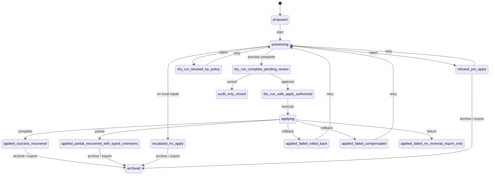

# Repair Transaction Lifecycle Statechart

Source contracts: `docs/support/repair_transaction_contract.md`,
`schemas/support/repair_transaction.schema.json`,
`schemas/support/repair_preview.schema.json`,
`schemas/support/repair_outcome.schema.json`,
`docs/support/recovery_ladder_packet.md`.

## States

| State | Meaning | Terminal | Recoverable | Retryable | Evidence / export / audit fields |
| --- | --- | --- | --- | --- | --- |
| `proposed` | Doctor, support, or recovery ladder proposed a repair transaction. | No | Yes | Yes | initiating finding codes, repair class |
| `previewing` | Repair preview is being built or shown. | No | Yes | Yes | preview artifact ref |
| `dry_run_complete_pending_review` | Preview ran and waits for user/admin review. | No | Yes | Yes | preview state class, blockers |
| `dry_run_safe_apply_authorized` | Preview is authorized to apply. | No | Yes | Yes | authority ticket/ref, preview ref |
| `dry_run_blocked_by_policy` | Preview was blocked by policy. | Yes | Yes | Yes if policy changes | preview blocker, policy ref |
| `applying` | Repair executor is applying under runtime requirements. | No | Yes | Yes with idempotency | checkpoint ref, idempotency key |
| `applied_success_recovered` | Apply succeeded and the recovery rung exited cleanly. | Yes | No | No | repair outcome ref, verification refs |
| `applied_partial_recovered_with_typed_unknowns` | Apply helped but typed unknowns remain. | Yes | Yes | Yes | remaining unknowns, outcome ref |
| `applied_failed_rolled_back` | Apply failed and rollback checkpoint restored. | Yes | Yes | Yes | rollback checkpoint ref, failure reason |
| `applied_failed_compensated` | Apply failed and compensating action restored equivalence. | Yes | Yes | Yes | reversal class, outcome ref |
| `applied_failed_no_reversal_export_only` | Apply failed and safe next step is escalation/export only. | Yes | Yes | No | escalation packet ref, outcome ref |
| `escalated_no_apply` | No local apply occurred; escalation packet was prepared. | Yes | Yes | No | escalation packet ref |
| `refused_pre_apply` | Apply was refused before mutation because a forbidden boundary would be crossed. | Yes | Yes | Yes if cause changes | refused reason, forbidden action |
| `audit_only_closed` | Transaction wrote only audit/evidence records. | Yes | No | No | audit event refs |
| `archived` | Transaction evidence is sealed for support/export/history. | Yes | No | No | export refs, audit event refs |

## Statechart

## Transitions And Authority

| Transition | From -> To | Recovery | Initiate | Approve / reject | Retry / repair | Preview | Checkpoint | Evidence / export / audit fields |
| --- | --- | --- | --- | --- | --- | --- | --- | --- |
| `lifecycle.repair_transaction.propose` | start -> `proposed` | none | `supervisor`, `support_operator`, `owning_subsystem` | `policy_service` may reject class | n/a | No | No | finding codes, repair class family |
| `lifecycle.repair_transaction.preview` | `proposed` -> `previewing` -> preview outcome | none | `repair_executor`, `support_operator` | `policy_service` | `repair_executor` | Yes | Proposed checkpoint when apply may mutate | preview artifact ref, preview state class |
| `lifecycle.repair_transaction.authorize` | `dry_run_complete_pending_review` -> `dry_run_safe_apply_authorized` | none | `interactive_user`, `admin`, `support_operator` with delegated authority | `policy_service`, user/admin | n/a | Yes | Yes when apply mode requires it | authority ticket ref, preview ref |
| `lifecycle.repair_transaction.apply` | `dry_run_safe_apply_authorized` -> `applying` -> success/partial | none | `repair_executor` | `policy_service` may halt on drift | `repair_executor` | Already required | Checkpoint/idempotency required for mutating modes | checkpoint ref, idempotency key, outcome ref |
| `lifecycle.repair_transaction.block_policy` | preview states -> `dry_run_blocked_by_policy` | `downgrade` | `policy_service` | `policy_service` | `support_operator` if policy changes | Yes | No mutation | preview blocker, policy ref |
| `lifecycle.repair_transaction.refuse` | preview states -> `refused_pre_apply` | `failure` | `repair_executor`, `policy_service` | n/a | `support_operator`, `interactive_user` if cause changes | Yes | No mutation | forbidden action class, refusal reason |
| `lifecycle.repair_transaction.rollback` | `applying` -> `applied_failed_rolled_back` or `applied_failed_compensated` | `rollback` | `repair_executor`, `supervisor` | User/admin if not pre-approved | `repair_executor` | Pre-approved or review required | Rollback checkpoint or reversal class required | rollback checkpoint ref, reversal class, outcome ref |
| `lifecycle.repair_transaction.fail_export` | `applying` -> `applied_failed_no_reversal_export_only` | `failure` | `repair_executor` | n/a | No local retry without new preview | No | Preserve failed checkpoint refs | escalation packet ref, failure reason |
| `lifecycle.repair_transaction.escalate` | preview states -> `escalated_no_apply` | none | `support_operator`, `repair_executor` | User/admin for export destination | n/a | Yes for export packet | No local mutation | escalation packet ref, support bundle refs |
| `lifecycle.repair_transaction.cancel_audit_only` | pending review -> `audit_only_closed` | `cancel` | `interactive_user`, `support_operator`, `policy_service` | n/a | n/a | No | No mutation | audit event refs |
| `lifecycle.repair_transaction.retry_preview` | recoverable terminal states -> `previewing` | `retry` | `interactive_user`, `support_operator`, `repair_executor` | `policy_service` | `repair_executor` | Yes | Idempotency key or new transaction id required | predecessor transaction ref, audit event |
| `lifecycle.repair_transaction.archive` | terminal states -> `archived` | none | `support_operator`, `admin`, `interactive_user` | User/admin for export | n/a | Yes for export | No | export refs, redaction class, audit event |

Boundary rule: a repair executor cannot approve its own preview. It may
apply only after preview, authority, checkpoint, idempotency, and
forbidden-action assertions are satisfied.
