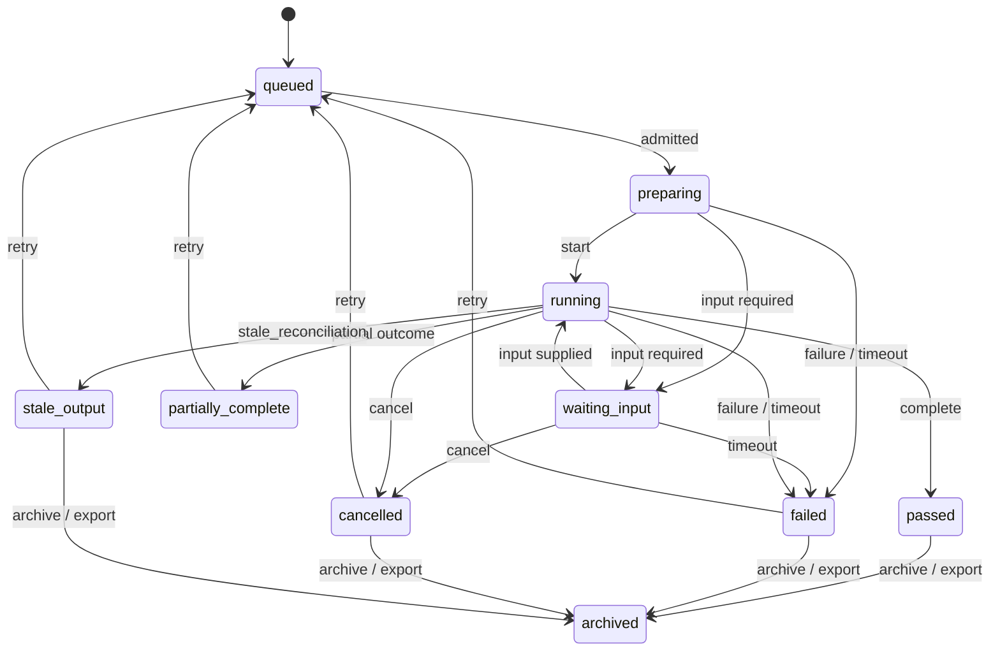

# Task / Run Attempt Lifecycle Statechart

Source contracts: `docs/execution/run_and_attempt_contract.md`,
`schemas/execution/run.schema.json`,
`schemas/execution/attempt.schema.json`,
`schemas/execution/artifact_event.schema.json`,
`docs/runtime/background_queue_contract.md`.

## States

| State | Meaning | Terminal | Recoverable | Retryable | Evidence / export / audit fields |
| --- | --- | --- | --- | --- | --- |
| `queued` | Run or attempt is admitted or waiting for capacity/dependency/input. | No | Yes | Yes | queue admission class, run id |
| `preparing` | Context, target, sandbox, credentials, and artifacts are resolving. | No | Yes | Yes | context snapshot ref, authority ticket ref |
| `running` | Attempt is executing under declared host boundary. | No | Yes | Yes | attempt id, task event trace id |
| `waiting_input` | Attempt needs typed input before it can proceed. | No | Yes | Yes | input request ref, expiry/deadline |
| `partially_complete` | Some outcome subsets are decided, others pending or undetermined. | Yes | Yes | Yes | outcome event refs, subset counters |
| `passed` | Attempt/run completed successfully. | Yes | No | Yes | outcome event refs, artifact event refs |
| `failed` | Attempt/run completed with typed failure. | Yes | Yes | Yes | failure class, outcome event refs |
| `cancelled` | User, policy, supervisor, or disconnect cancelled the attempt. | Yes | Yes | Yes when idempotent | cancellation authority class |
| `stale_output` | Output exists but no longer maps to current context. | Yes | Yes | Yes | stale output drift layer, rerun comparison ref |
| `archived` | Run and attempt evidence is retained for history/support/export. | Yes | No | No | support/export refs, audit event refs |

## Statechart

## Transitions And Authority

| Transition | From -> To | Recovery | Initiate | Approve / reject | Retry / repair | Preview | Checkpoint | Evidence / export / audit fields |
| --- | --- | --- | --- | --- | --- | --- | --- | --- |
| `lifecycle.task_run_attempt.queue` | start -> `queued` | none | `interactive_user`, `command_router`, `automation_scheduler`, `ai_assistant` | `policy_service`, `supervisor` | n/a | Irreversible runs require preview before queue | Idempotency key for repeatable side effects | run id, queue admission class |
| `lifecycle.task_run_attempt.prepare` | `queued` -> `preparing` | none | `owning_subsystem` | `policy_service`, `supervisor` | n/a | No | Checkpoint when resuming failed step | context snapshot ref, authority ticket ref |
| `lifecycle.task_run_attempt.start` | `preparing` -> `running` | none | `owning_subsystem` | `supervisor` | n/a | No | No | attempt id, task event trace id |
| `lifecycle.task_run_attempt.input` | `preparing` or `running` -> `waiting_input` -> `running` | `timeout` if expired | `owning_subsystem` | User rejects/approves input | `interactive_user` | Yes for irreversible or secret prompts | Checkpoint when resuming/restarting is offered | input request ref, typed result |
| `lifecycle.task_run_attempt.complete` | `running` -> `passed` or `partially_complete` | none | `owning_subsystem` | n/a | `interactive_user` for rerun | No | No | outcome event refs, artifact event refs |
| `lifecycle.task_run_attempt.fail` | `preparing`, `running`, or `waiting_input` -> `failed` | `failure` or `timeout` | `owning_subsystem`, `supervisor` | n/a | `interactive_user`, `automation_scheduler` under admitted lineage | No | Preserve failed-step checkpoint when present | failure class, outcome event refs |
| `lifecycle.task_run_attempt.cancel` | `running` or `waiting_input` -> `cancelled` | `cancel` | `interactive_user`, `policy_service`, `supervisor`, `remote_agent` | n/a | `interactive_user` when safe | No | Preserve attempt evidence | cancellation authority class, audit event |
| `lifecycle.task_run_attempt.stale` | `running` or terminal output -> `stale_output` | `stale_reconciliation` | `owning_subsystem`, `provider_service` | n/a | `interactive_user` | Review rerun intent | Rerun comparison / checkpoint ref | stale output drift layer, rerun comparison ref |
| `lifecycle.task_run_attempt.retry` | `failed`, `cancelled`, `stale_output`, or `partially_complete` -> `queued` | `retry` | `interactive_user`, `automation_scheduler`, `supervisor` | `policy_service` | `owning_subsystem` | Yes when side effects may repeat | Idempotency key or checkpoint ref required | predecessor attempt ref, rerun kind class |
| `lifecycle.task_run_attempt.archive` | terminal states -> `archived` | none | `workspace_owner`, `support_operator`, `admin` | User/admin for export beyond boundary | n/a | Yes for export | No | support/export refs, redaction posture, audit event |

Boundary rule: retry creates a new attempt record or successor run
relationship. It never overwrites prior attempt logs, outcome events,
or artifact events.
