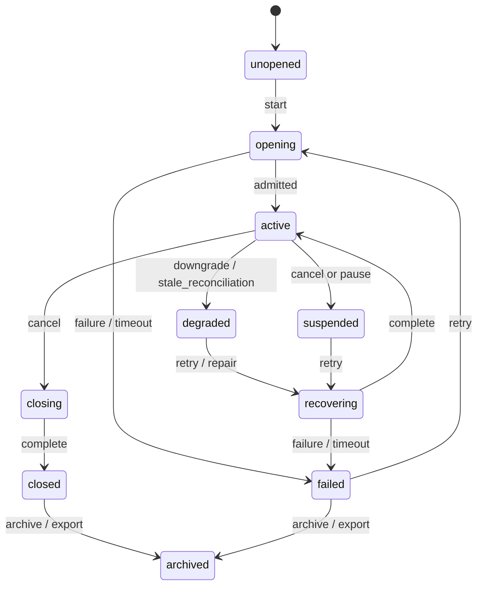

# Workspace / Session Lifecycle Statechart

Source contracts: `docs/workspace/entry_restore_object_model.md`,
`docs/ux/crash_loop_and_restore_fidelity_contract.md`,
`docs/governance/runtime_authority_contract.md`,
`docs/architecture/service_topology_and_process_placement.md`.

## States

| State | Meaning | Terminal | Recoverable | Retryable | Evidence / export / audit fields |
| --- | --- | --- | --- | --- | --- |
| `unopened` | No live workspace/session object exists. | No | No | No | entry route ref, restore prompt ref |
| `opening` | Workspace identity, trust, restore, and runtime target are resolving. | No | Yes | Yes | entry action ref, restore manifest ref, authority ticket ref |
| `active` | Workspace/session is usable under the declared trust and target identity. | No | Yes | No | execution context id, trust state, active checkpoint refs |
| `degraded` | Workspace is usable with narrowed route, trust, freshness, or restore fidelity. | No | Yes | Yes | downgrade reason, last known good ref, support evidence refs |
| `recovering` | Supervisor or support flow is trying to restore a healthy state. | No | Yes | Yes | recovery action ref, checkpoint ref, evidence refs |
| `suspended` | Workspace is paused or restored as layout/evidence only; no live work is running. | No | Yes | Yes | restore fidelity class, preserved state refs |
| `closing` | Close/cancel is in progress and state preservation is being finalized. | No | Yes | No | close action ref, active checkpoint refs |
| `closed` | Session is stopped; no live authority remains. | Yes | Yes | Yes | restore prompt ref, session manifest ref |
| `failed` | Open, restore, or recovery failed with a typed reason. | Yes | Yes | Yes | failure reason, crash envelope ref, evidence refs |
| `archived` | Workspace/session evidence is sealed for history, support, or export. | Yes | No | No | archive ref, export refs, audit event refs |

## Statechart

## Transitions And Authority

| Transition | From -> To | Recovery | Initiate | Approve / reject | Retry / repair | Preview | Checkpoint | Evidence / export / audit fields |
| --- | --- | --- | --- | --- | --- | --- | --- | --- |
| `lifecycle.workspace_session.open` | `unopened` -> `opening` | none | `interactive_user`, `workspace_owner`, `automation_scheduler` | `policy_service` may reject | n/a | No | Restore checkpoint when restoring prior state | entry action ref, trust state, audit event |
| `lifecycle.workspace_session.admit` | `opening` -> `active` | none | `supervisor`, `remote_agent` | `policy_service` | n/a | No | No | execution context id, restore manifest ref |
| `lifecycle.workspace_session.open_failed` | `opening` -> `failed` | `failure` or `timeout` | `supervisor`, `remote_agent` | n/a | `interactive_user`, `supervisor` | No | Preserve existing restore/checkpoint refs | failure reason, crash/support evidence, audit event |
| `lifecycle.workspace_session.downgrade` | `active` -> `degraded` | `downgrade` or `stale_reconciliation` | `supervisor`, `remote_agent`, `policy_service` | `policy_service` for policy causes | `supervisor`, `support_operator` | Details surface required | Preserve-state refs required | downgrade reason, last known good ref, audit event |
| `lifecycle.workspace_session.recover` | `degraded` -> `recovering` | `retry` or `repair` | `interactive_user`, `supervisor`, `support_operator` | User/admin required when authority widens | `supervisor`, `repair_executor` | Yes when state mutates | Yes for durable restore or repair | recovery action ref, checkpoint ref, repair transaction ref |
| `lifecycle.workspace_session.recovered` | `recovering` -> `active` | none | `supervisor` | `policy_service` may reject on drift | n/a | No | No | recovery outcome ref, audit event |
| `lifecycle.workspace_session.suspend` | `active` -> `suspended` | `cancel` | `interactive_user`, `workspace_owner`, `supervisor` | `policy_service` may reject managed cases | `interactive_user` | No | Preserve open buffers and restore manifest | restore fidelity class, preserved state refs |
| `lifecycle.workspace_session.close` | `active` -> `closing` -> `closed` | `cancel` | `interactive_user`, `workspace_owner` | n/a | `interactive_user` may reopen | No | Yes when dirty buffers or active checkpoints exist | close action ref, session manifest ref, audit event |
| `lifecycle.workspace_session.retry_open` | `failed` -> `opening` | `retry` | `interactive_user`, `supervisor` | `policy_service` | `supervisor` | Yes if prior restore may be discarded | Checkpoint/idempotency ref required | predecessor transition ref, evidence refs |
| `lifecycle.workspace_session.archive` | `closed` or `failed` -> `archived` | none | `workspace_owner`, `support_operator`, `admin` | User/admin for export beyond local boundary | n/a | Yes for export | No unless archive mutates retention state | archive ref, export refs, audit event |

Boundary rule: a degraded or suspended session must not claim `active`
until target identity, trust state, restore fidelity, and policy epoch
are revalidated.

