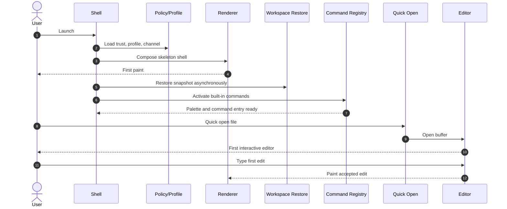
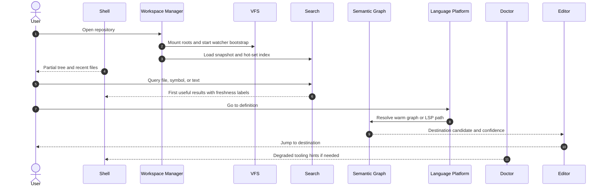
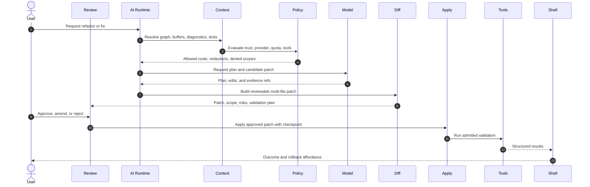
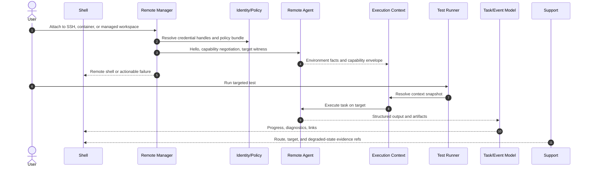
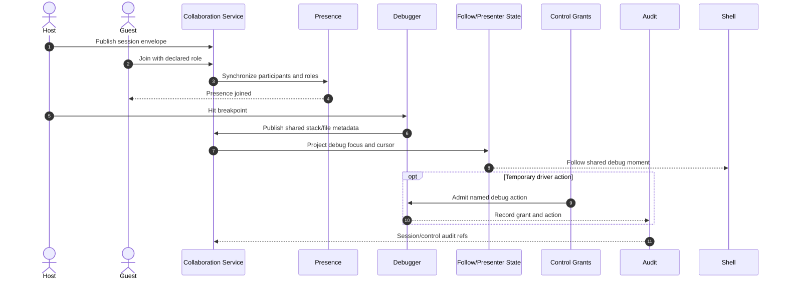

# Critical Sequence Diagrams And Latency Allocation

This document freezes the protected cross-subsystem journeys that
performance review, architecture review, support reconstruction, and
failure-injection fixtures must discuss with the same stage names.

The machine-readable latency pack is
[`/artifacts/perf/critical_sequence_latencies.yaml`](../../artifacts/perf/critical_sequence_latencies.yaml).
The reviewer checklist is
[`/fixtures/architecture/sequence_review_checklist.md`](../../fixtures/architecture/sequence_review_checklist.md).

## Review Rules

Every stage below has a matching `stage_id` in the latency pack. A
change that moves work across a protected stage boundary must update the
diagram, the latency pack, the linked failure case, and the support
reconstruction hook in the same review.

Stage posture:

| Posture | Meaning |
|---|---|
| `protected` | User-visible critical path with a budget, deadline, trace/span identity, and review evidence. |
| `backgroundable` | May begin during the journey but must not block the protected deadline. |
| `optional` | Improves the experience but may be skipped, degraded, or unavailable with visible truth. |
| `forbidden_on_hot_path` | Must not run inline on the protected path. If needed, it moves behind a helper, worker, or explicit approval path. |

Truth posture:

| State | Contract |
|---|---|
| Fresh | Surface may claim live or authoritative state only when the typed evidence row is current. |
| Stale | Stale results may be shown only with freshness, source, and recovery labels. |
| Missing provider | Provider-backed work must preserve local editing and explain the unavailable provider. |
| Degraded | Degraded mode must name the narrowed capability and the local work that remains usable. |

## Warm Startup To First Edit

| Stage ID | Posture | Budget / deadline | Cancellation | Fallback and truth |
|---|---|---|---|---|
| `seq_stage.warm_start.launch_policy` | protected | 80 ms allocation; contributes to first paint <= 150 ms | User can abort launch; crash loop routes to safe mode | Credential/profile lock is a visible degraded startup state, not a blank wait |
| `seq_stage.warm_start.first_paint` | protected | 120 ms allocation; first paint deadline <= 150 ms | Superseded window launch cancels stale paint | Shell paint wins over restore, indexing, extensions, AI, and network |
| `seq_stage.warm_start.restore_snapshot` | backgroundable | 120 ms allocation inside first interactive editor <= 700 ms | Restore can be skipped or opened without restore | Missing targets restore to layout-only or compatible level with a recovery note |
| `seq_stage.warm_start.command_entry_ready` | protected | Command palette available <= 400 ms | Palette invocation can cancel stale cache hydration | Built-in command graph may be partial but must be truthful and keyboard reachable |
| `seq_stage.warm_start.quick_open_buffer` | protected | File open budget follows `budget.path.editor.placeholder_open`; first interactive editor <= 700 ms | Query and open request can be cancelled independently | Editable buffer may precede semantic readiness with visible partial state |
| `seq_stage.warm_start.first_edit_paint` | protected | Key-to-paint p95 <= 8 ms after editor is active | Edit batch can be undone; stale semantic work is cancelled | Diagnostics, AI, and indexing refine later; edit truth is local and immediate |

Forbidden on the hot path: full index rebuilds, third-party extension
activation, provider calls, support bundle generation, Git full status,
network fetches, blocking filesystem scans, and process launch.

Evidence links: `path.shell.launch`,
`path.shell.first_useful_chrome`, `path.command_palette.open`,
`path.editor.placeholder_open`, `path.editor.first_useful_edit`,
`budget.warm_path.*`, `ff.warm_start_to_first_paint`,
`ff.first_paint`, `ff.input_to_paint`, `ff.buffer_operations`,
and `FIT-JOUR-001`.

Failure and reconstruction: startup crash loops, locked credential
stores, and restore failures must map to
`fixtures/support/recovery_ladder_cases/crash_loop_safe_mode.yaml` or
`fixtures/auth/callback_and_lock_state_cases/credential_store_locked_on_launch.json`.
Support reconstruction uses `support_hook.warm_start.first_edit` with
the `local_only_action` scenario class and must resolve exact build,
command, invocation, docs pack, recovery rung, and redaction posture.

## Open Large Repository To First Useful Navigation

| Stage ID | Posture | Budget / deadline | Cancellation | Fallback and truth |
|---|---|---|---|---|
| `seq_stage.large_repo.open_admitted` | protected | Open intent admitted <= 50 ms | Reopen or close cancels stale root work | Shell remains responsive while workspace workers start |
| `seq_stage.large_repo.root_enumeration_kick` | protected | Root enumeration starts <= 150 ms | Root crawl is cancellable by workspace close | Unknown roots are labelled partial; no full scan blocks shell input |
| `seq_stage.large_repo.partial_tree_visible` | protected | Partial tree usable <= 800 ms typical | Tree hydration cancels stale roots | Missing watcher or ignored scope appears as partial, degraded, or unsupported |
| `seq_stage.large_repo.hot_index_ready` | backgroundable | Hot snapshot should feed first query; full index is not on the deadline | Query cancels lower-priority indexing | Warm cache, changed files, and fallback scanner may answer before semantic index |
| `seq_stage.large_repo.first_results` | protected | First useful search result <= 150 ms warm | Query cancellation drops stale result streams | Results must show source, freshness, and confidence; stale results may not disappear silently |
| `seq_stage.large_repo.symbol_jump` | protected | First symbol jump <= 300 ms warm | Go-to-definition cancels stale graph/LSP requests | Text or file navigation fallback is allowed when semantic provider is missing |

Forbidden on the hot path: complete repository indexing, full Git
status, package-manager graph resolution, dependency downloads, remote
provider calls, unbounded language-server startup waits, and blocking
watcher recovery.

Evidence links: `path.shell.first_useful_chrome`,
`path.command_palette.open`, `path.editor.placeholder_open`,
`seg.quick_open.*`, `ff.command_parity`, `ff.benchmark_lab_health`,
`FIT-PERF-003`, `FIT-GRAPH-001`, and `FIT-JOUR-001`.

Failure and reconstruction: watcher loss, stale graph, missing tooling,
or degraded semantic readiness must map to
`fixtures/support/escalation_packet_completeness_cases/broken_watcher_stalled_no_events.yaml`,
`fixtures/editor/refactor_cases/partial_rename_stale_graph.yaml`, or
`fixtures/editor/viewport_summary_cases/degraded_semantics_partial_markers.json`.
Support reconstruction uses `support_hook.large_repo.first_navigation`
with the `wrong_target_or_degraded_state_action` scenario class when
route or provider truth is degraded, otherwise `local_only_action`.

## AI-Assisted Multi-File Change With Approval

| Stage ID | Posture | Budget / deadline | Cancellation | Fallback and truth |
|---|---|---|---|---|
| `seq_stage.ai.request_admitted` | protected | Intent admission <= 50 ms | User cancel drops the turn before provider work | Local editor remains usable; no background branch starts without visible run truth |
| `seq_stage.ai.context_resolution` | protected | Hot local context resolution <= 300 ms | Stale context jobs cancel on changed workset or policy epoch | Omitted, redacted, policy-blocked, and tainted segments are explicit |
| `seq_stage.ai.policy_route_gate` | protected | Gate before provider egress; local denial <= 100 ms target | Policy change cancels route and invalidates receipts | Missing provider yields local diagnostics and a disabled apply path |
| `seq_stage.ai.first_model_token` | optional | First model token median <= 1.5 s when provider is available | User cancel or provider timeout stops spend and tools | Provider unavailability is a visible degraded AI state, never an editor block |
| `seq_stage.ai.diff_render` | protected | Diff render <= 200 ms for moderate changes | New model revision cancels stale diff | Multi-file patch is reviewable before apply; generated/protected files are labelled |
| `seq_stage.ai.approval_checkpoint_apply` | protected | Checkpointed apply target <= 400 ms for moderate local patch, provisional until calibrated | Reject or close keeps checkpoint unapplied | Every write is reversible or honestly compensating; no auto-apply bypass |
| `seq_stage.ai.validation_stream` | backgroundable | First validation event target <= 1 s after admitted run starts | Validation attempts are cancellable run records | Failed, partial, stale, or skipped validation is typed on the run/attempt rail |

Forbidden on the hot path: raw secret export, provider egress before
policy, hidden MCP/tool side effects, direct write without review,
auto-apply after stale context, untyped model/provider identity, and
raw provider payload in support exports.

Evidence links: `docs/ai/context_assembly_contract.md`,
`docs/ai/evidence_replayability_contract.md`,
`docs/ux/shell_interaction_safety_contract.md`, `ff.buffer_operations`,
`ff.vfs_save_conflict_handling`, `FIT-AI-TOOLS-001`,
`FIT-AI-EVAL-001`, `FIT-REF-001`, and `FIT-JOUR-001`.

Failure and reconstruction: provider unavailable, tainted retrieved
context, and non-replayable raw-byte-dependent turns must map to
`fixtures/ai/replay_cases/partial_replay_provider_unavailable.json`,
`fixtures/ai/context_assembly_cases/composer_turn_with_tainted_retrieved_document.yaml`,
or `fixtures/ai/replay_cases/non_replayable_raw_byte_dependent.json`.
Support reconstruction uses `support_hook.ai.multi_file_change` with
the `provider_bearing_action` scenario class and must resolve context
assembly, route receipt, spend receipt, evidence packet, approval
ticket, mutation journal, and running build identity.

## Remote Attach And Run Targeted Test

| Stage ID | Posture | Budget / deadline | Cancellation | Fallback and truth |
|---|---|---|---|---|
| `seq_stage.remote.attach_intent` | protected | Attach intent admitted <= 100 ms | User cancel releases pending credential handle | No credential prompt can hide target or policy scope |
| `seq_stage.remote.policy_auth` | protected | Policy/auth bootstrap target <= 1 s | Auth timeout cancels attach and leaves local workspace intact | Missing credential or policy denial is actionable, not a spinner |
| `seq_stage.remote.agent_hello` | protected | Agent hello and capability negotiation target <= 1.5 s | Disconnect cancels mutations and preserves read-only state if admitted | Capability envelopes narrow; they never silently widen |
| `seq_stage.remote.environment_facts` | protected | Remote shell or actionable failure <= 5 s total | Target witness change requires reapproval before mutation | Stale target, missing provider, or drift may show cached facts with warning |
| `seq_stage.remote.execution_context` | protected | Test dispatch p95 <= 400 ms after user action | Context drift cancels dispatch or prompts for rerun intent | Execution context carries target, toolchain, scope, trust, and policy refs |
| `seq_stage.remote.test_stream` | protected | First task metadata event <= 1 s after remote task start | User, policy, supervisor, or disconnect cancellation is typed | Partial, stale, failed, and unsupported test truth is explicit |
| `seq_stage.remote.preview_routes` | optional | Preview/forwarded route does not block attach or test | Route provider loss suspends traffic | Browser handoff or tunnel is disabled with provider/route truth |

Forbidden on the hot path: raw secret projection, command execution
before target witness, silent retargeting, public tunnel publish before
approval, hidden local fallback that claims remote parity, and remote
helper restart loops that collapse the shell.

Evidence links: `docs/adr/0020-remote-agent-contract.md`,
`docs/runtime/execution_context_vocabulary.md`,
`docs/execution/run_and_attempt_contract.md`,
`docs/execution/test_truth_contract.md`, `FIT-REMOTE-001`,
`FIT-EXEC-001`, `FIT-RUN-001`, and `FIT-JOUR-001`.

Failure and reconstruction: provider-unavailable handoff, retarget
collision, degraded read-only reconnect, and wrong-target correction
must map to `fixtures/remote/attach_cases/provider_unavailable_browser_handoff.yaml`,
`fixtures/remote/attach_cases/stale_target_retarget_collision.yaml`,
`fixtures/remote/attach_cases/reconnect_degraded_read_only.yaml`, or
`fixtures/support/reconstruction_cases/wrong_target_remote_attach_corrected.yaml`.
Support reconstruction uses `support_hook.remote.attach_run_test` with
`provider_bearing_action` or `wrong_target_or_degraded_state_action`
and must resolve exact build, command, invocation, target identity,
route posture, recovery rung, repair/checkpoint refs, and redaction.

## Join Collaboration And Follow Shared Debug Moment

| Stage ID | Posture | Budget / deadline | Cancellation | Fallback and truth |
|---|---|---|---|---|
| `seq_stage.collab.publish_envelope` | protected | Publish or actionable failure target <= 500 ms | Owner cancel returns to solo | Session envelope names trust, retention, guest, region, and export posture |
| `seq_stage.collab.join_presence` | protected | Presence join <= 2 s median | Guest cancel leaves no replayable authority | Join may degrade to local view only; local editing is never frozen |
| `seq_stage.collab.presence_update` | protected | Cursor/presence update p95 <= 200 ms same-region | Paused follow stops live projection | Stale or unavailable live state uses summary or local-view-only labels |
| `seq_stage.collab.debug_metadata` | protected | Shared debug metadata p95 target <= 200 ms after host event | Debug session end cancels follow projection | Inspect-only is distinct from temporary step/continue grant |
| `seq_stage.collab.follow_projection` | protected | Follow projection target <= 300 ms, provisional until calibrated | Observer can pause follow without leaving session | Missing live state never injects input into guest shell/debug/editor |
| `seq_stage.collab.control_grant` | optional | Grant mint/revoke target <= 500 ms when requested | Revocation is immediate and non-replayable | Presenter does not imply driver; every mutating debug action needs a grant |
| `seq_stage.collab.audit_refs` | backgroundable | Audit refs emitted before archive or support export | Archive seal can be cancelled before terminal state | Metadata-only defaults unless session policy admits retained payloads |

Forbidden on the hot path: CRDT/session relay blocking local buffer
edits, control inferred from presence, hidden terminal/debug input
replay on join, retained full payload without consent/policy, silent
anchor relocation, and shared debug mutation without a control grant.

Evidence links: `docs/collaboration/session_authority_contract.md`,
`docs/collaboration/shared_control_contract.md`,
`docs/execution/debug_truth_contract.md`, `FIT-COLLAB-001`,
`FIT-COLLAB-002`, `FIT-COLLAB-003`, and `FIT-JOUR-001`.

Failure and reconstruction: relay loss, degraded follow, revoked debug
grant, and shared-debug inspect-only overlays must map to
`fixtures/collaboration/session_cases/relay_loss_local_editing_continues.yaml`,
`fixtures/collaboration/shared_control/degraded_follow_no_input_injection.yaml`,
`fixtures/collaboration/shared_control/debug_grant_admin_signed_retained.yaml`,
or `fixtures/execution/debug_cases/shared_debug_overlay.yaml`.
Support reconstruction uses `support_hook.collab.shared_debug_follow`
with the `wrong_target_or_degraded_state_action` scenario class when
session state degraded, and must resolve session state, shared object
authority, follow/presenter row, debug posture, control grant, audit
refs, and exact build identity.
